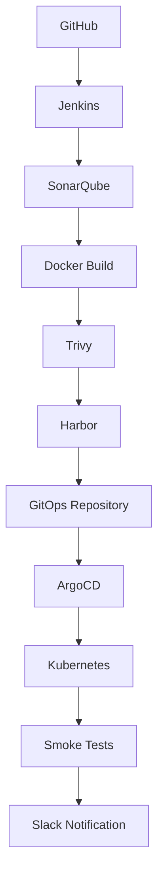

# DevOps Pipeline Examples

Production-oriented Jenkins Declarative Pipelines for common application and infrastructure delivery patterns. The repository is intentionally sanitized for public use: endpoints are placeholders, credentials are Jenkins credential IDs, and application-specific assumptions are exposed as parameters.

## Purpose

These examples show the operational details that short pipeline demos usually omit: deterministic dependency installation, quality gates, artifact retention, image scanning, deployment promotion, bounded retries, test publishing, and cleanup. They are reference implementations, not a shared library or turnkey platform.

## Architecture



A rendered version is available in [docs/architecture.png](docs/architecture.png).

## Pipelines

| Pipeline | Agent | Delivery outcome |
| --- | --- | --- |
| [.NET ClickOnce](jenkins/Jenkinsfile-dotnet-clickonce) | Windows | Restores, builds, tests, measures coverage, publishes ClickOnce, and archives the release. |
| [Node.js GitOps](jenkins/Jenkinsfile-nodejs-gitops) | Linux with Docker | Tests and scans an application, publishes an immutable image, updates Helm values, syncs ArgoCD, and verifies the deployment. |
| [Java Maven](jenkins/Jenkinsfile-java-maven) | Linux with JDK 17/Maven | Runs Maven verification and SonarQube analysis, then archives the JAR. |
| [Terraform](jenkins/Jenkinsfile-terraform) | Linux with Terraform | Formats, validates, scans, plans, and applies infrastructure through an approval gate. |

The Kubernetes and Helm assets deploy the same placeholder web workload. Raw manifests suit direct `kubectl` or Kustomize workflows; the chart demonstrates environment-specific packaging.

## Delivery flow

### Continuous integration

1. Jenkins checks out the exact revision and installs dependencies from lock files.
2. Linters and unit tests fail fast; Jenkins publishes test and coverage reports even when tests fail.
3. SonarQube evaluates maintainability and security findings.
4. The build produces a versioned application artifact or immutable container image.
5. Trivy blocks container publication when high or critical vulnerabilities are found.

### Continuous delivery

1. Jenkins pushes the immutable image tag to Harbor.
2. Jenkins changes only `image.tag` in the target Helm values file and pushes that commit with SSH credentials.
3. ArgoCD detects the Git commit; an explicit sync keeps deployment timing visible in the Jenkins run.
4. Jenkins waits for a healthy application, runs a smoke request, and sends the final result to Slack.

See [CI/CD flow](docs/ci-cd-flow.md), [GitOps operating model](docs/gitops.md), and [ArgoCD notes](docs/argocd.md) for the design decisions and failure boundaries.

## Technologies

Jenkins, GitHub, Node.js, npm, .NET Framework/MSBuild, NuGet, Maven, SonarQube, Docker, Trivy, Harbor, Git, Helm, Kustomize, ArgoCD, Kubernetes, Terraform, AWS, Slack, and `yq` v4.

## How to run

### Prerequisites

- Jenkins agents matching the labels declared in each Jenkinsfile.
- Jenkins plugins: Pipeline, Git, Credentials Binding, SSH Agent, JUnit, Code Coverage, SonarQube Scanner, Workspace Cleanup, and Slack Notification.
- Tool installations named `nodejs-20`, `jdk-17`, `maven-3.9`, `terraform-1.8`, `nuget-6`, and `msbuild-2022`, or corresponding name changes in the Jenkinsfiles.
- CLI tools on relevant agents: Docker, Trivy, `yq` v4, ArgoCD, Helm, kubectl, TFLint, and Checkov.
- Jenkins credentials described in each Jenkinsfile. Secret values must remain in the Jenkins credential store. The .NET test project uses the `JunitXml.TestLogger` and `coverlet.collector` NuGet packages.

Create a Jenkins Pipeline or Multibranch Pipeline, point it at this repository, and set the script path, for example:

```text
jenkins/Jenkinsfile-nodejs-gitops
```

Replace every `*.example.com` value and placeholder repository path with endpoints owned by your environment. Review parameters before the first run; deployment and Terraform apply are disabled by default.

To inspect the deployment resources locally:

```bash
kubectl kustomize kubernetes
helm lint helm
helm template example-app helm --namespace example-app
terraform -chdir=terraform init -backend=false
terraform -chdir=terraform validate
```

## Repository layout

```text
.
├── docs/          Design notes and rendered architecture
├── helm/          Deployable application chart
├── images/        Screenshot placeholders and future media
├── jenkins/       Declarative pipelines and shared-library guidance
├── kubernetes/    Kustomize-compatible raw manifests
└── terraform/     AWS registry and artifact-storage example
```

## Screenshots

Portfolio screenshots should be captured from a non-production environment and checked for hostnames, usernames, build logs, and secrets before publication.

| View | Placeholder |
| --- | --- |
| Jenkins stage view | `images/jenkins-stage-view.png` |
| ArgoCD application health | `images/argocd-application.png` |
| SonarQube quality gate | `images/sonarqube-quality-gate.png` |

## Interview talking points

- Why image tags use the Git SHA plus Jenkins build number and never `latest`.
- Why CI writes desired state to Git instead of changing the cluster directly.
- How test publication in `post` preserves diagnostics on failed builds.
- Where retries help with transient network failures and where they would hide deterministic failures.
- How deployment concurrency, approval gates, credential scope, and timeouts limit operational risk.
- How the examples would move into a versioned Jenkins shared library as adoption grows.

## Future improvements

- Sign images with Cosign and verify signatures through an admission policy.
- Generate SBOMs and attach provenance using SLSA-compatible attestations.
- Add ephemeral Kubernetes build agents and dependency caches.
- Add preview environments for pull requests.
- Promote a single image digest across environments instead of rebuilding.
- Add policy-as-code checks for Terraform, Kubernetes, and Helm releases.

## License

Released under the [MIT License](LICENSE).
